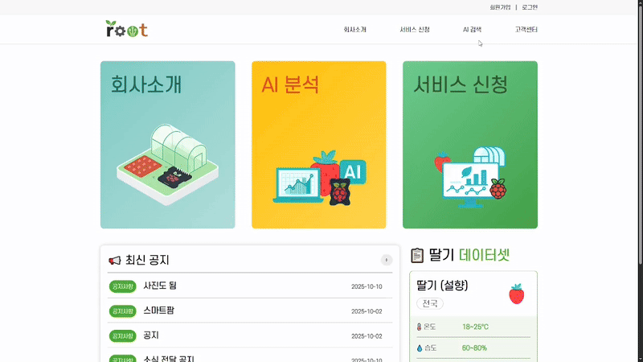
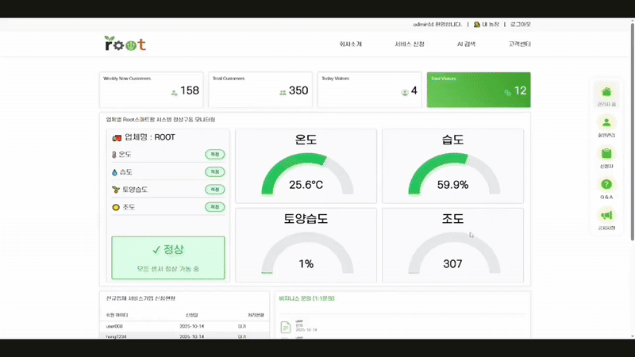
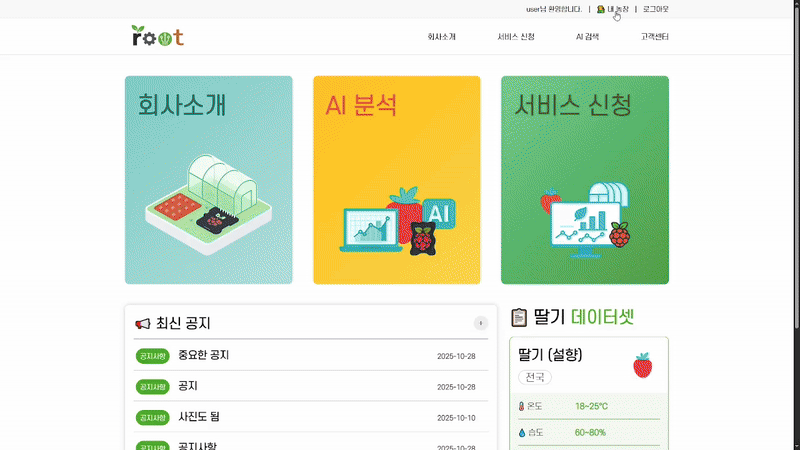
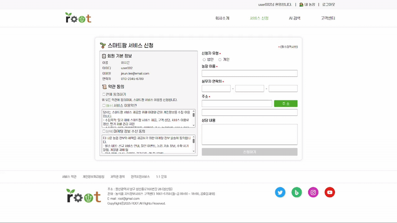
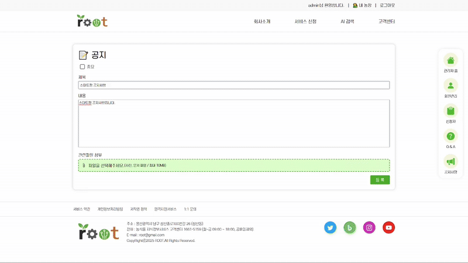
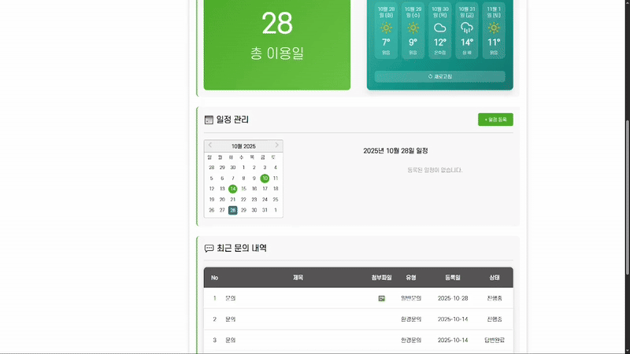
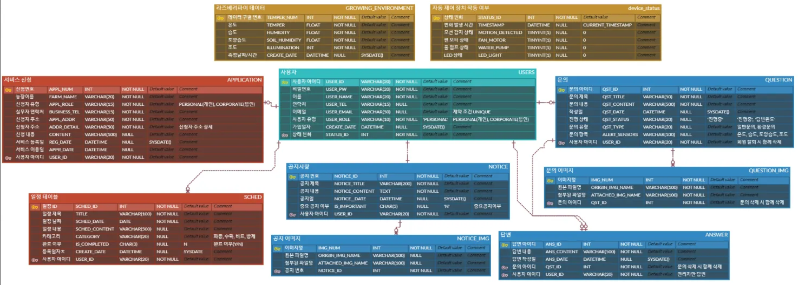

# 🌱 스마트팜 IoT 모니터링 시스템

<div align="center">


**라즈베리파이 기반 스마트팜 IoT 기기 연동 및 실시간 웹 모니터링 시스템**

</div>

### 🎯 백엔드 목적

IoT 센서 데이터를 **안정적으로 수집, 저장, 제공**하며, **확장 가능한 RESTful API 구조**를 통해 Frontend와 효율적으로 통신합니다.

### 🎯 프론트엔드 목적

농장주와 관리자가 **한눈에 데이터를 파악**하고 **쉽게 조작**할 수 있도록 직관적이고 시각적으로 매력적인 UI/UX를 제공합니다.

---

## 📋 프로젝트 개요

서비스 제공 업체가 **라즈베리파이와 웹사이트를 농장주에게 제공**하는 환경에서, IoT 센서로 수집된 환경 데이터(온도, 습도, 토양습도, 조도 등)를 웹으로 실시간 모니터링할 수 있는 시스템입니다.

### 개발 기간
**2025.09.11 ~ 2025.11.14** 

### 팀 구성
**5명**의 팀원이 협업하여 개발

---

## 🎯 프로젝트 목적

1차 프로젝트에서 저장된 데이터를 기반으로 **작물의 관리 상태**와 **기기의 구동 여부**를 웹에서 확인할 수 있도록 하는 것이 핵심 목표입니다.

### 주요 목표
- 환경 데이터를 웹으로 정확하게 시각화
- 농장주의 의사결정을 돕는 모니터링 도구 제공
- 사용자 편의성을 높이기 위한 기능 구현

---

## 🌾 배경

서비스 제공 업체가 농장주에게 **라즈베리파이와 웹사이트를 함께 제공**하는 비즈니스 모델을 기반으로 합니다.

---

## 💡 시스템의 역할

본 시스템은 **데이터를 정확하게 보여주는 역할**만 수행합니다.

- ✅ IoT 센서 데이터를 수집하여 웹에 표시
- ✅ 환경 변화를 모니터링
- ✅ 작물 관리 상태 및 기기 구동 여부 확인

> 💡 **중요**: 실제 작물 관리는 농장주가 제공된 데이터를 기반으로 직접 수행합니다.

---

## 🛠 기술 스택

### Frontend


### Backend


### Tools


---

## ✨ 주요 기능

### 🌡️ 환경 관리 데이터 모니터링
- 온도, 습도, 토양습도, 조도 센서 최신 데이터 표시
- 팬 모터, 물펌프, LED, 모션 감지 자동 제어 장치 최신 작동 횟수 표시

### 📊 데이터 시각화
- 차트를 통한 시간대별 환경 변화 추이
- 직관적인 대시보드 UI

### 🔔 알림 및 관리 기능
- 이상 수치 발생으로 인한 문의 시 실시간 알림
- QnA 및 공지사항 관리

---

## 📱 담당 주요 화면 구성

### 1️⃣ 웹 구조

> 💡 **내용**  
> 일반 회원인지 관리자인지에 따라 사이트 이용범위가 달라집니다.  
> (관리자는 우측에 전용 사이드바 생성)



**주요 기능**
- 🖥️ 사용자 권한에 따른 UI 분리
- 🔑 로그인 상태 기반 헤더 메뉴 변경

---

### 2️⃣ QnA 실시간 알림

> 💡 **내용**  
> 농장주가 특이사항을 발견하면 문의를 넣을 수 있고 
> 해당 문의는 알림으로 관리자에게 즉시 반영됩니다.  
> 또한, 관리자는 실시간으로 답변을 남길 수 있습니다.



**주요 기능**
- 🖥️ 농장주별 데이터 특이사항 실시간 확인
- 💬 실시간 문의 알림
- 🔔 UX 개선을 위한 toast/배지 표시

---

### 3️⃣ 마이페이지(메인•상세 모니터링, 기본 정도 등)

> 💡 **내용**  
> 메인 모니터링 페이지에서 최신 환경 데이터를 확인하고, 7일 상세 페이지에서 자동 제어 기록과 과거 데이터를 통해 농장 환경을 관리할 수 있습니다.  
> 뿐만 아니라, 전용 메뉴를 통해 날씨 정보와 문의 등 농장 관리 기능도 이용 가능합니다.



**주요 기능**
- 🌡️ 실시간 환경 데이터 모니터링
- 📊 과거 데이터 통계 및 자동 제어 기록 모니터링
- 🗂️ 농장 관리 전용 메뉴 (날씨 정보, 문의 등)

---

### 4️⃣ 서비스 신청

> 💡 **내용**  
> 스마트팜 모니터링 페이지를 이용하기 위한 서비스 신청을 하는 페이지입니다.



**주요 기능**
- ✏️ 필수 입력 완료 시 버튼 활성화
- 🗺️ Daum API 주소 연동


---

### 5️⃣ 공지사항 CRUD

> 💡 **내용**  
> 게시글 관리 기능을 최대한 현실적으로 반영한 공지사항 페이지입니다.
> CRUD뿐만 아니라 UX를 고려하여 이미지 수정, 페이징, 검색도 가능합니다.



**주요 기능**
- 🔄 공지사항 CRUD
- 📤 공지 이미지 업로드 및 삭제
- 📝 Pagination
- 🔍 조건별 필터 검색
- 🗑️ 공지사항 전체 삭제

---

### 6️⃣ 캘린더

> 농장주는 캘린더로 일정을 등록하고 확인할 수 있습니다.



**주요 기능**
- 🛒 일정 CRUD

---

## 🎨 UI 흐름 설명

### 사용자 플로우
```
로그인 
   ↓
메인 대시보드 (센서 데이터 확인)
   ↓
상세 모니터링 (차트 및 통계)
   ↓
QnA / 공지사항 
```

### 관리자 플로우
```
관리자 로그인
   ↓
농장주 특이사항 실시간 모니터링 대시보드
   ↓
공지사항 작성 및 QnA 답변 / 회원•서비스 신청 목록 
```

---

## 🔧 핵심 기술 구현

### WebSocket 실시간 통신
- Spring WebSocket + STOMP 프로토콜 활용
- 관리자와 농장주 간 실시간 데이터 전송
- 새로고침 없이 실시간 알림 수신

### 차트 라이브러리
- 일일별 환경 변화 시각화
- 환경 데이터 통계 차트 구현

---

## 🗄️ ERD (Entity Relationship Diagram)



---

## 📡 핵심 API 명세서

### 1️⃣ 센서 데이터 API

#### 📌 전체 센서 데이터 조회
```http
GET /api/growings/list

Response: 200 OK
[
  {
    "temperNum": 1,
    "temper": 25.6,
    "humidity": 59.9,
    "soilHumidity": 45.2,
    "illumination": 307,
    "createDate": "2025-09-09T14:30:00"
  }
]
```

#### 📌 7일간 센서 데이터 조회
```http
GET /api/growings/weekly

Response: 200 OK
[
  {
    "temperNum": 100,
    "temper": 24.5,
    "humidity": 60.1,
    "soilHumidity": 43.8,
    "illumination": 315,
    "createDate": "2025-09-02T10:00:00"
  }
]
```

#### 📌 최신 자동제어장치 작동 횟수 조회
```http
GET /api/motions/latest

Response: 200 OK
{
  "motionDetected": 12,
  "fanMotor": 5,
  "waterPump": 8,
  "ledLight": 15,
  "timestamp": "2025-09-09T15:00:00"
}
```

---

### 2️⃣ WebSocket 실시간 알림 API

#### 📌 관리자 알림 구독 (환경문의 발생 시)
```http
STOMP SUBSCRIBE /topic/admin

Message:
{
  "userId": "user01",
  "sensors": ["온도", "습도", "조도"],
  "timestamp": "2025-09-09T15:00:00"
}
```

#### 📌 사용자 알림 구독 (답변 등록 시)
```http
STOMP SUBSCRIBE /topic/user/{userId}

Message: "답변이 등록되었습니다."
```

#### 📌 환경문의 등록 (관리자에게 알림 전송)
```http
POST /questions

Request Body (multipart/form-data):
{
  "qstTitle": "온도가 너무 높아요",
  "qstContent": "온도가 30도를 넘었습니다",
  "qstType": "환경문의",
  "alertSensors": "온도,습도,조도",
  "userId": "user01",
  "file": (file)
}

Response: 201 Created
"등록완료"

⭐ WebSocket 알림 자동 전송:
→ /topic/admin 으로 실시간 알림 전송
```

#### 📌 답변 등록 (사용자에게 알림 전송)
```http
POST /answers

Request Body:
{
  "qstId": 5,
  "answerContent": "온도 설정을 확인해주세요."
}

Response: 201 Created
"답변 완료"

⭐ WebSocket 알림 자동 전송:
→ /topic/user/{userId} 로 "답변이 등록되었습니다." 메시지 전송
```

---

## 💡 핵심 구현 코드

### 1️⃣ Enum으로 코드량 50% 감소

#### 📄 UploadPath Enum
```java
public enum UploadPath {
    QUESTION("question"),  // Question 이미지 업로드 경로
    NOTICE("notice");      // Notice 이미지 업로드 경로
    
    private final String path;
    
    UploadPath(String path) {
        this.path = path;
    }
    
    public String getPath() {
        return this.path;
    }
}
```

**효과**
- 공지사항, QnA 등의 이미지 업로드 로직 통합
- 중복 코드 50% 제거
- 유지보수성 및 확장성 향상
- 새로운 업로드 타입 추가 시 Enum만 수정

---

### 2️⃣ 범용적 api 설계

#### 📄 재사용성을 고려한 API 설계
```xml
<!-- 오늘 제어 횟수 조회 -->
<select id="getTodayDeviceStatus" resultMap="deviceStatus">
    SELECT STATUS_ID
    , TIMESTAMP
    , MOTION_DETECTED
    , FAN_MOTOR
    , WATER_PUMP
    , LED_LIGHT
    FROM DEVICE_STATUS
    WHERE DATE(TIMESTAMP) = CURDATE()
    ORDER BY TIMESTAMP DESC;
</select>
```

```java
// 오늘 제어 횟수 조회
@GetMapping("/today")
public ResponseEntity<?> getTodayDeviceStatus(){
  try {
    return ResponseEntity
          .status(HttpStatus.OK)
          .body(motionBuzzerService.getTodayDeviceStatus());
  } catch (Exception e) {
    e.printStackTrace();
    return ResponseEntity
          .status(HttpStatus.INTERNAL_SERVER_ERROR)
          .body("조회 중 오류 발생");
  }
}
```

**특징**
- 엔드포인트 탐색이 용이
- API 구조 최적화
- 3차 개발까지 안정적 사용

---

### 3️⃣ Spring WebSocket 실시간 통신

#### 📄 WebSocket Configuration
```java
@Configuration
@EnableWebSocketMessageBroker  // WebSocket 메시지 브로커 활성화
public class WebSocketConfig implements WebSocketMessageBrokerConfigurer {

  @Override
  public void configureMessageBroker(MessageBrokerRegistry config) {
    // 클라이언트가 구독할 경로 설정 (서버 → 클라이언트)
    config.enableSimpleBroker("/topic");
  }

  @Override
  public void registerStompEndpoints(StompEndpointRegistry registry) {
    // WebSocket 연결 엔드포인트 설정
    registry.addEndpoint("/ws")  // ws://localhost:8080/ws 로 연결
            .setAllowedOriginPatterns("*")  // 모든 origin 허용 (학원 내부망 포함)
            .withSockJS();  // SockJS 지원 (WebSocket 미지원 브라우저 대응)
  }
}
```

#### 📄 실시간 알림 Controller
```java
@Controller
@RequiredArgsConstructor
public class NotificationController {

  private final SimpMessagingTemplate messagingTemplate;

  // 관리자에게 알림
  public void notifyAdmin(String userId, String sensors) {
    // WebSocket으로 보낼 데이터 구성
    Map<String, Object> alertData = new HashMap<>();
    alertData.put("userId", userId);                           // 문의자 ID
    alertData.put("sensors", Arrays.asList(sensors.split(","))); // 센서 배열로 변환
    alertData.put("timestamp", LocalDateTime.now().toString());  // 현재 시간

    // "/topic/admin" 구독 중인 관리자에게 전송
    messagingTemplate.convertAndSend("/topic/admin", alertData);
  }

  // 특정 사용자에게 알림
  public void notifyUser(String userId, String message) {
    messagingTemplate.convertAndSend("/topic/user/" + userId, message);
  }
}
```

**구현 내용**
- STOMP 프로토콜 활용
- 관리자와 농장주 간 실시간 알림
- 새로고침 없이 실시간 업데이트
- QnA 질문 등록 시 관리자에게 즉시 알림

---

## 📂 프로젝트 구조
```
src/
├── main/
│   ├── java/
│   │   └── com.green.backend_root/
│   │       ├── answer/                  # QnA 답변 관리
│   │       │   ├── controller/
│   │       │   ├── service/
│   │       │   ├── dto/
│   │       │   └── mapper/
│   │       ├── application/             # 신청자 관리
│   │       │   ├── controller/
│   │       │   ├── service/
│   │       │   ├── dto/
│   │       │   └── mapper/
│   │       ├── common/                  # 공통 기능
│   │       │   └── NotificationController.java
│   │       ├── config/                  # 설정 파일
│   │       │   ├── WebConfig.java
│   │       │   └── WebSocketConfig.java
│   │       ├── counter/                 # 방문자 카운터 (Redis)
│   │       │   ├── RedisConfig.java
│   │       │   ├── VisitorController.java
│   │       │   └── VisitorService.java
│   │       ├── email/                   # 이메일 발송
│   │       │   ├── controller/
│   │       │   ├── service/
│   │       │   └── dto/
│   │       ├── growing/                 # 환경 데이터
│   │       │   ├── controller/
│   │       │   ├── service/
│   │       │   ├── dto/
│   │       │   └── mapper/
│   │       ├── motionBuzzer/            # 자동 제어 장치 작동 횟수
│   │       │   ├── controller/
│   │       │   ├── service/
│   │       │   ├── dto/
│   │       │   └── mapper/
│   │       ├── notice/                  # 공지사항
│   │       │   ├── controller/
│   │       │   ├── service/
│   │       │   ├── dto/
│   │       │   └── mapper/
│   │       ├── plantBot/                # 식물 챗봇 (AI)
│   │       │   ├── ChatController.java
│   │       │   ├── ChatMessage.java
│   │       │   ├── ChatService.java
│   │       │   └── PlantService.java
│   │       ├── question/                # QnA 질문
│   │       │   ├── controller/
│   │       │   ├── service/
│   │       │   ├── dto/
│   │       │   └── mapper/
│   │       ├── schedule/                # 일정 관리
│   │       │   ├── controller/
│   │       │   ├── service/
│   │       │   ├── dto/
│   │       │   └── mapper/
│   │       ├── user/                    # 사용자 관리
│   │       │   ├── controller/
│   │       │   ├── service/
│   │       │   ├── dto/
│   │       │   └── mapper/
│   │       ├── util/                    # 유틸리티
│   │       │   ├── FileUploadUtil.java
│   │       │   ├── QuestionFileUploadUtil.java
│   │       │   └── UploadPath.java
│   │       └── BackendRootApplication.java  # 메인 애플리케이션
│   └── resources/
│       ├── mapper/                      # MyBatis XML 매퍼
│       │   ├── answer-mapper.xml
│       │   ├── application-mapper.xml
│       │   ├── growing-mapper.xml
│       │   ├── motion-mapper.xml
│       │   ├── notice-mapper.xml
│       │   ├── question-mapper.xml
│       │   ├── schedule-mapper.xml
│       │   └── user-mapper.xml
│       ├── static/
│       │   └── upload_files/            # 업로드된 파일
│       │       ├── notice/
│       │       └── question/
│       ├── templates/
│       ├── application.properties       # 애플리케이션 설정
│       ├── log4jdbc.log4j2.properties  
│       └── logback.xml                 
└── test/
    └── java/
```

---

<div align="center">
  
**안정적이고 확장 가능한 백엔드 구조**  
**직관적인 UI로 사용자 경험 극대화** 

</div>
